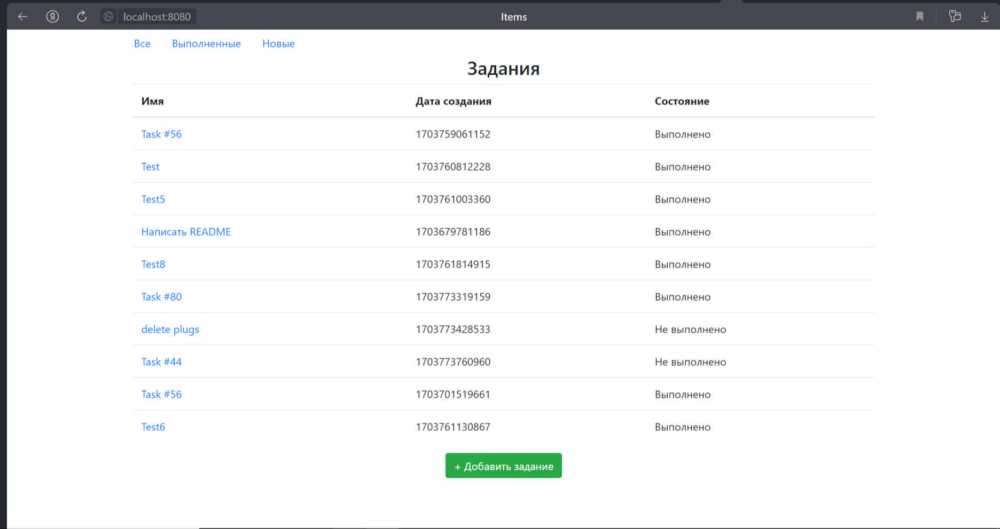
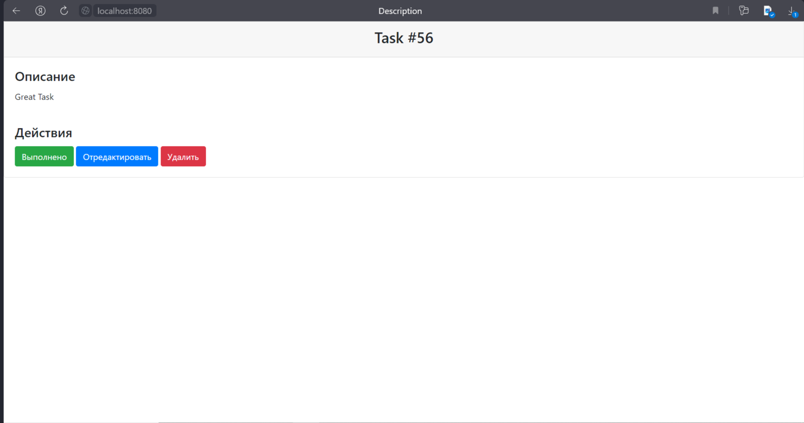
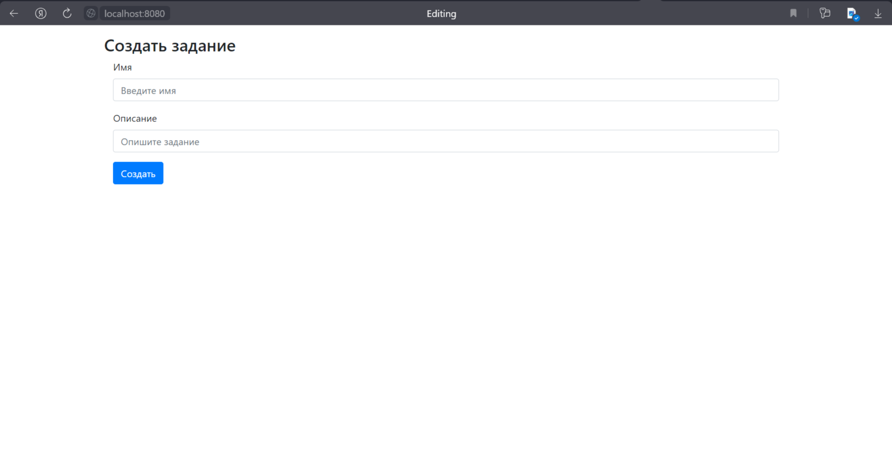

This repository presents a "ToDo list" application. When the application starts, a home page appears and we can view all
tasks added to the ToDo list:

The home page has a table with tasks and three links for selecting all/done/new tasks. There are three columns in the
table: name, date and status. When we click on a task we go to a description page where we can find information about
selected task:

Also, there are three buttons: done, edit and delete. which help us to interact with the task. 

The home page also has the "add a task" button that redirect you to edit page:

- Если нажали на кнокпу выполнить, то задание переводиться в состояние выполнено.
- Кнопка редактировать переводит пользователя на отдельную страницу для редактирования.
- Кнопка удалить, удаляет задание и переходит на список всех заданий.