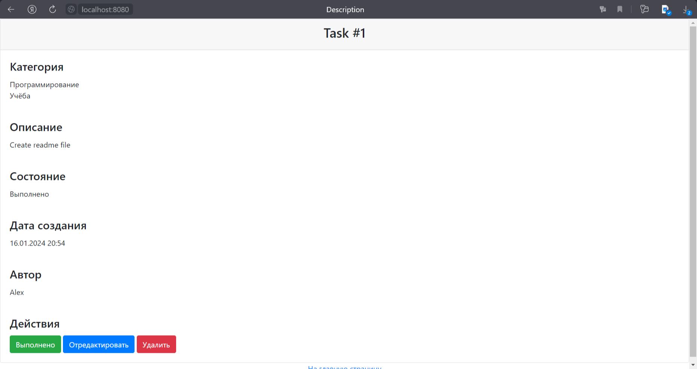

This repository presents a "ToDo list" application.

When the application starts, an authorization page appears:  

We must log in or register if we are not registered:  

If the registration was successful, then we get to the success page, from where we can go to the authorization page:

After we log in, a home page appears, and we can view all tasks added to the to-do list:

The home page has three links on the top (all/done/new) and a table with tasks that is changing depending on the
selected link. There are three columns in the table: name, date of creation and status (completed or not completed).

The "done" link:  

The "new" link:

The home page also has the "add a task" button that takes the user to an edit page:

On the home page, clicking on a task takes us to a page with detailed description of the task:

There are three buttons on the description page: done, edit and delete, which help us to interact with the task.

The "edit" button takes the user to the edit page where he can edit the task (its name and description):

If the "done" button is clicked, the task is transferred to the completed status:

The "delete" button deletes the task and takes the user to the list of all tasks.
